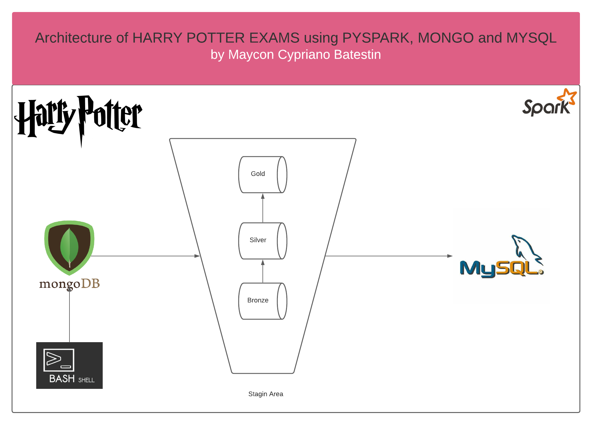

<h1 align="center">


<h3> <p align="center">BIG DATA SIMULATION HARRY POTTER EXAMS </p> </h3>
<h3> <p align="center"> ================= </p> </h3>

>> <h3> Solution Architecture </h3>




>> <h3> Description </h3>
-------------------------

<p> Harry Potter is a popular culture franchise present in books, movies and games.
In this universe we are introduced to a world where Witches have disciplines similar to our world.
They are schools that teach, herbology, arts against darkness, magic and many other lessons.
Based on this principle, we adopt the evaluative criteria of a World Exam.
Students from various schools of magic around the world decided to participate in this competition with their best students.
Who is smarter?
Find out by simulating this BIG DATA project that uses two databases as data analytics.
The first, MONGODB, is used as the initial repository and MYSQL is the final repository.
This way you can see how data is structured in its non-relational form and the transformations (there are 3) to the relational stage.
Check out!

Below is a glossary of data.</p>

>> <h3> Glossary of Data </h3>
------------------------------

Fields	                                                  | Type  	  |    Description                              |
----------------------------------------------------------|:---------:|:-------------------------------------------:|
id	                        							  |string 	  | exam registration                           |
notebook												  |string     | test notebook color                         |
first_name	  										  	  |string     | first name of participants	                |
last_name												  |string     | last name of participants                   |
race													  |string     | race of participants                        |
birthday												  |string     | birthday of participants                    |
age														  |integer    | age of participants                         |
civil_statu												  |string     | civil status of participants 	            |
phone													  |string     | phone of participants                       |
occupation     											  |string     | occupation of participants                  |
mailer  												  |string     | mailer                                      |
school													  |string     | school of participants                      |
country													  |string     | country						                |
houses		     										  |string     | house of school of participants			    |
patronus		   										  |string     | patronus	                                |
wand		  											  |string     | wand	                                    |
identification_number									  |string     | identification number of participants       |
divination												  |string     | subject									    |
alchemy            										  |string     | subject                                     |
apparition	                     	    				  |string     | subject		                                |
arithmancy												  |string     | subject     			                    |
muggle_art              								  |string     | subject                  				    |
dark_arts			       								  |string     | subject           						    |
astronomy		  										  |string     | subject	                                    |
defense_against_the_dark_arts							  |string     | subject    		                            |
study_of_ancient_runes    								  |string     | subject                                     |
muggle_study  											  |string     | subject                                     |
gender     												  |string     | gender                                      |
ancient_studies											  |string     | subject		                                |
advanced_arithmancy_studies     						  |string     | subject                          		    |
spells                 									  |string     | subject                                     |
herbology		  										  |string     | subject	                                    |
history_of_magic		  								  |string     | subject                                     |
general_knowledge_of_magic								  |string     | subject                                     |
potions          										  |string     | subject                                     |
theory_of_magic         								  |string     | subject                                     |
transfiguration        									  |string     | subject                                     |
care_of_magical_creatures     							  |string     | subject				                        |
media													  |string     | media of subject	                        |
yearmonthday          									  |string     | partition by                                |


>> <h3> Description </h3>
-------------------------

<p> To run the project, you need to install the dependencies located in the "dependencies" folder and in the root of the project, run the shell_script "run_script.sh". </p>


>> <h3> Sample of Payload in MONGO </h3>
-------------------------
> mongo
```
{
    "_id": {
        "$oid": "61b3fe3e2d3ec7405c5ca299"
    },
    "TEST_REGISTRATION": "ZPXF24637425883078",
    "NOTEBOOK": "BLUE",
    "STUDENT_DATA": {
        "NAME": "Alexander Thorsen",
        "GENDER": "M",
        "RACE": "WIZARD",
        "BIRTHDAY": "1970-05-04",
        "AGE": "51",
        "CIVIL_STATUS": "DIVORCED",
        "PHONE": "49 73 87 37",
        "OCCUPATION": "Astronomer",
        "NU_IDENTIFICATION": "25123213273",
        "MAILER": "ale251232@yahoo.com",
        "PATRONUS": "AVESPORA",
        "WAND": "HAIR OF OTTER"
    },
    "SCHOOL_DATA": {
        "SCHOOL_REGISTRATION": "HAKC47898340719757",
        "SCHOOL": "DURMSTRANG",
        "COUNTRY": "NORWAY",
        "HOUSES": "FOLKOR"
    },
    "EXAM_DATA": {
        "MEDIA": 877.38,
        "SUBJECTS": {
            "DIVINATION": 95,
            "ALCHEMY": 57,
            "APPARITION": 14,
            "ARITHMANCY": 20,
            "MUGGLE_ART": 58,
            "DARK_ARTS": 6,
            "ASTRONOMY": 16,
            "DEFENSE_AGAINST_THE_DARK_ARTS": 25,
            "STUDY_OF_ANCIENT_RUNES": 66,
            "MUGGLE_STUDY": 51,
            "ANCIENT_STUDIES": 52,
            "ADVANCED_ARITHMANCY_STUDIES": 19,
            "SPELLS": 18,
            "HERBOLOGY": 62,
            "HISTORY_OF_MAGIC": 50,
            "DEFAULT": 82,
            "POTIONS": 73,
            "THEORY_OF_MAGIC": 33,
            "TRANSFIGURATION": 43,
            "CARE_OF_MAGICAL_CREATURES": 92
        }
    }
}register_data":"20210423"
}
```


----------------------------------------------
>> <h3> Sample of Payload in MYSQL </h3>
-------------------------
> 

```
id                |notebook|first_name|last_name    |race           |birthday  |age|civil_status|phone                 |occupation                              |school       |country|houses        |patronus             |wand                             |identification_number|mailer                   |divination|alchemy|apparition|arithmancy|muggle_art|dark_arts|astronomy|defense_against_the_dark_arts|study_of_ancient_runes|muggle_study|ancient_studies|advanced_arithmancy_studies|spells|herbology|history_of_magic|general_knowledge_of_magic|potions|theory_of_magic|transfiguration|care_of_magical_creatures|media  |yearmonthday|
------------------+--------+----------+-------------+---------------+----------+---+------------+----------------------+----------------------------------------+-------------+-------+--------------+---------------------+---------------------------------+---------------------+-------------------------+----------+-------+----------+----------+----------+---------+---------+-----------------------------+----------------------+------------+---------------+---------------------------+------+---------+----------------+--------------------------+-------+---------------+---------------+-------------------------+-------+------------+
ABAT59919057625120|RED     |Ana       |Vitória      |HUMANS (MUGGLE)|1952/00/03| 69|DIVORCED    |080-5018-4820         |STUDENT                                 |CASTELOBRUXO |BRAZIL |null          |YELLOW IRIS          |NOSE OF COSCO                    |15378296021          |a1537829@yahoo.com       |      11.0|   27.0|      87.0|       6.0|      25.0|     42.0|     63.0|                          2.0|                  54.0|        92.0|           17.0|                       70.0|   3.0|     89.0|            52.0|                      30.0|   58.0|           52.0|           94.0|                     58.0| 889.76|    20210010|
ABPI58274953555056|RED     |Brita     |Blomqvist    |WIZARD         |1932/00/07| 89|WIDOWED     |08-042 66 98          |Insurance account manager               |KOLDOVSTORETZ|RUSSIAN|BLACK COURT   |DUNLIN               |LUNG OF SARITEIA                 |078-20-5930          |bri078-@yahoo.com        |      61.0|   97.0|      95.0|      37.0|       1.0|     63.0|     17.0|                         97.0|                  63.0|        76.0|           75.0|                       87.0|  33.0|     17.0|            40.0|                      49.0|   23.0|           96.0|           40.0|                     22.0|1094.05|    20210010|
```

>> Resume of Country

```
metric               |amount|score               |
---------------------+------+--------------------+
Total of Africa      | 12348|1.236281766999999E7 |
Total of France      | 12375|1.2399866199999932E7|
Total of EUA         | 12623|1.2667126720000027E7|
Total of Japan       | 12405|1.2454013400000053E7|
Total of England     | 12599|1.2621927350000009E7|
Total of Brazil      | 12540|1.2586295839999942E7|
Total of Norway      | 12586|1.262036918999996E7 |
Total of Participants|100011|null                |
Total of Russian     | 12535|1.254879237000005E7 |

```

>> Resume of Hogwarth

```
metric                           |amount|score            |
---------------------------------+------+-----------------+
Total of Ravenclaw               |  3072|3075715.020000008|
Total of Slytherin               |  3098|3103050.570000002|
Total of Gryffindor              |  3200|3206314.879999992|
Total of Hufflepuff              |  3229|3236846.88       |
Total of Participents of Hogwarth| 12599|null             |

```